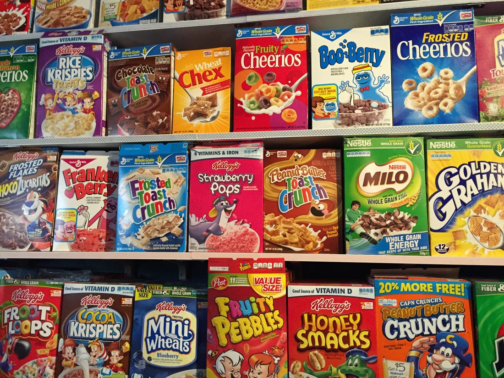

<style type="text/css">

h1 { /* Header 1 */
  font-size: 32px;
  color: lightseagreen;
}

h2 { /* Header 2 */
    font-size: 25px;
    color: dodgerblue;
}

h3 { /* Header 3 */
  font-size: 20px;
  color: mediumorchid;
}
 
</style>


<h2> Here, we will use ggplot to visualize how many grams of sugar are in different cereals. <br> 
<h3>Data can be found <a href="https://www.kaggle.com/crawford/80-cereals" target="_blank">here</a><br>
Inspiration from  <a href="https://twitter.com/WeAreRLadies/status/1280859374668283906" target="_blank">this awesome R Ladies' Tweet</a></h3>

<center>  </center> <br>
<h2>We will start with a basic box plot and get more creative with our visualisations as we go! </h2>


<h3> Load  libraries </h3>
```{r message=FALSE, warning=FALSE, include=FALSE}
library(tidyverse)
library(here)
library(papaja) # may have to install directly from github devtools::install_github("crsh/papaja")
library(ggeasy)
library(ggrepel)
```

<h3> Read in data and do a little bit of data exploration </h3>
```{r message=FALSE, echo=FALSE}

mydat <- read_csv(here("ggplot_transformation", "cereal.csv")) 

# find out how many of each cereals per manufacturer mfr
mydat %>%
  group_by(mfr) %>%
  count() %>%
  arrange(n) 

# interested in exploring how much sugar is in each cereal
sugar <- mydat %>% # grams of sugar
  filter(mfr != "A" & mfr != "N") %>% # going to drop A and N because only 1 and 6 cereals so not enough observations
  select(name, mfr, calories, fiber, sugars, rating) %>% # just chose some that I'm more interested in
  group_by(mfr) %>%
  summarise(mean_sugar = mean(sugars),
            sd_sugar = sd(sugars))

# rename the manufacturers 
sugar <- mydat %>% # grams of sugar
  filter(mfr != "A" & mfr != "N") %>%
  select(name, mfr, calories, fiber, sugars, rating) %>%
  mutate(mfr = ifelse(mfr == "Q", "Quaker Oats",
         ifelse(mfr == "R", "Ralston Purina",
         ifelse(mfr == "G", "General Mills",
         ifelse(mfr == "K", "Kelloggs", "Post")))))

sugar
```

<h2> We will start with the most basic box plot </h2>
```{r}
ggplot(sugar, aes(x=mfr, y=sugars)) +
  geom_boxplot()
```

<h2> Next, we will: <br>
1) transform the plot so the coordinates are flipped so it's easier to read the labels <br>
2) reorder the box plots and <br>
3) add color and labels <br>
4) change the theme and text size </h2>
```{r}
ggplot(sugar, aes(x = reorder(mfr, sugars, FUN = median), y=sugars, color=mfr)) + # reorder the box plots and add color (could also do "fill" instead of "color")
  geom_boxplot(lwd=1) +
  labs(y = "Grams of Sugar", x = "Manufacturer") + # add labels
  coord_flip() + # flip the plot
  theme_apa() + # change to a cleaner theme
  easy_text_size(size = 20) + # change text size
  easy_x_axis_title_size(size = 25) +
  easy_y_axis_title_size(size = 25) +
  easy_remove_legend()
```

<h2> Next, we will add violin plots in addition to the box plots </h2>
```{r}
ggplot(sugar, aes(x = reorder(mfr, sugars, FUN = median), y=sugars, color=mfr)) + 
  geom_violin(lwd = 1) + # just added this one line
  geom_boxplot(width=.2) +
  labs(y = "Grams of Sugar", x = "Manufacturer") +
  coord_flip() +
  theme_apa() +
  easy_text_size(size = 20) +
  easy_x_axis_title_size(size = 25) +
  easy_y_axis_title_size(size = 25) +
  easy_remove_legend()
```

<h2> Next, we will: <br>
1) remove the box plots, but add in 0.25, 0.5, and 0.75 quantiles <br>
2) plot individual data points <br>
3) plot the means </h2>
```{r}
ggplot(sugar, aes(x = reorder(mfr, sugars, FUN = median), y=sugars, color=mfr)) +
  geom_violin(draw_quantiles = c(0.25, 0.75), lwd=1, linetype="dashed") + # add dashed lines at .25 and .75 quantiles
  geom_violin(fill = "transparent", draw_quantiles = 0.5, lwd=1) + # add line at .5 quantile
  # doesn't align perfectly with median of boxplot or the stat summary because quantiles for violin plot are computed on the density estimate whereas the quantiles for boxplots are computed on the actual data
  geom_jitter() + # add the individual data points (jitter separates points so they aren't right on top of each other)
  stat_summary(fun=mean, geom="point", shape=18, size=6, color="black", fill="black") + # add black diamonds for the means 
  # so if you put fun.y=median, it will still be slightly off the .5 violin plot
  labs(y = "Grams of Sugar", x = "Manufacturer") +
  coord_flip() +
  theme_apa() +
  easy_text_size(size = 20) +
  easy_x_axis_title_size(size = 25) +
  easy_y_axis_title_size(size = 25) +
  easy_remove_legend()
```

<h2> Next, we will add cereal labels to the individual data points...may take a few seconds to load and will be pretty overwhelming </h2>
```{r fig.height=10, fig.width=10}
pos <- position_jitter(seed = 1) # need to set the position so the data points and labels match up 

ggplot(sugar, aes(x = reorder(mfr, sugars, FUN = median), y=sugars, color=mfr, label=name)) +
  geom_violin(draw_quantiles = c(0.25, 0.75), lwd=1, linetype="dashed") +
  geom_violin(fill = "transparent", draw_quantiles = 0.5, lwd=1) +
  # add labels:  
  geom_label_repel(
    point.padding = 0.2,
    arrow = arrow(length = unit(0.015, "npc")),
    position=pos
  ) +
  geom_jitter(color ="grey", position=pos) +
  stat_summary(fun=mean, geom="point", shape=18, size=6, color="black", fill="black") +
  labs(y = "Grams of Sugar", x = "Manufacturer") +
  coord_flip() +
  theme_apa() +
  easy_text_size(size = 20) +
  easy_x_axis_title_size(size = 25) +
  easy_y_axis_title_size(size = 25) +
  easy_remove_legend()
```

<h2> Finally we will only include labels to cereals with ratings > 50 (these data points will be black and all others will be grey) </h2> 
<h3> I was actually pretty surprised by this.. I expected the higher rated cereals to have more sugar </h2>
```{r fig.height=10, fig.width=10}
# filters only the cereals with ratings greater than 50 
high_rate <- sugar %>%
  filter(rating > 50) %>%
  select(name) %>%
  unlist()
sugar$name <- as.character(sugar$name)

ggplot(sugar, aes(x = reorder(mfr, sugars, FUN = median), y=sugars, color=mfr, label= ifelse(name %in% high_rate, name, ""))) + # adjust the label here so it only selects the names listed in the high_rate variable
  geom_violin(draw_quantiles = c(0.25, 0.75), lwd=1, linetype="dashed") +
  geom_violin(fill = "transparent", draw_quantiles = 0.5, lwd=1) +
  geom_label_repel(
    point.padding = 0.2,
    arrow = arrow(length = unit(0.015, "npc")),
    position=pos
  ) +
  geom_jitter(color = ifelse(sugar$rating > 50, "black", "grey"), position=pos) + # adjusts the colors of the individual data points so > 50 are black and the rest are grey
  stat_summary(fun=mean, geom="point", shape=18, size=6, color="black", fill="black") +
  labs(y = "Grams of Sugar", x = "Manufacturer") +
  coord_flip() +
  theme_apa() +
  easy_text_size(size = 20) +
  easy_x_axis_title_size(size = 25) +
  easy_y_axis_title_size(size = 25) +
  easy_remove_legend()

```

